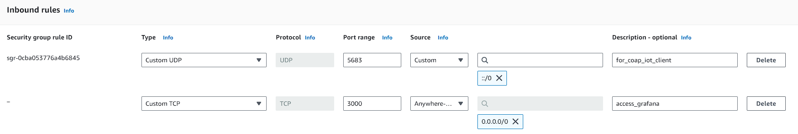
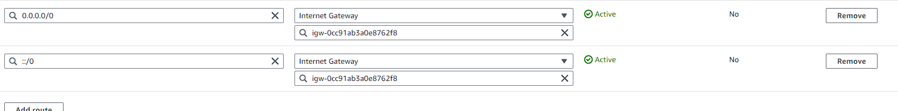

# IOT-mini-project-1

## How to install

### server

#### IPv6 enabled amazon EC2 instance

- Get an IPv6 enabled amazon instance (Ubuntu preferred as we are using docker-compose)
  - Reference [Configure IPv6 for AWS EC2 Instance : YouTube](https://www.youtube.com/watch?v=N4S6UjR6gUY)
  - follow the link [Amazon Docs : ipv6-addressing](https://docs.aws.amazon.com/AWSEC2/latest/UserGuide/using-instance-addressing.html#ipv6-addressing)
  - Remember to add inbound rules and routing table

        ##### Inbound Rules

        
        This is okay for a production environment. And you only have to enable UDP for IPv6 sources. For security you may want to add specific source addresses.

        ##### IPv6 Routing

        
 
- Install docker and docker compose plugin
    If you are using an recommended ubunutu server you can run the script to install docker and all the tools

        server\amazon_ubuntu_docker_install.sh

    References

  - <https://docs.docker.com/engine/install/ubuntu/>

- After that you can clone this repository inside amazon EC2 instance
  - cd into server folder
  - use docker compose

        cd server
        docker compose up --build -d

  - grafana dashboard and data influxdb are already setup via docker compose

### Testbed
- Get ssh access to frontend
- login to grenoble site
- clone the repository
- cd into repository folder
- In the `sensor\main.c` add your EC2 instance public IPv6 addrss
    `coap_command[i++] = "mention_your_ipv6_here";`
    eg:
        `coap_command[i++] = "2600:1234:1234:1234:1234:1234:1234:1234";`
- Then run `all.sh`
    - This builds the sensor code with new ip address
    - Star the border router (already built)